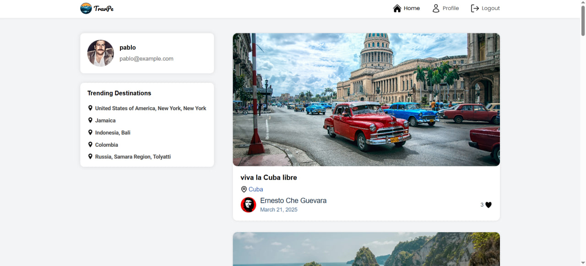
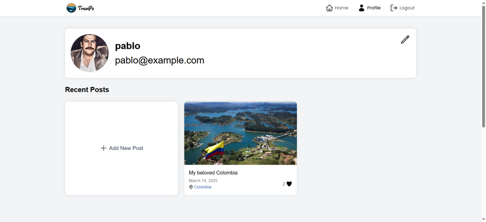
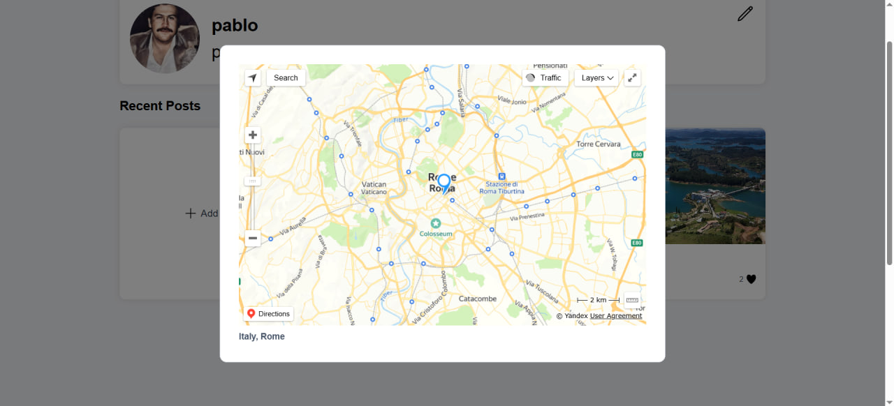
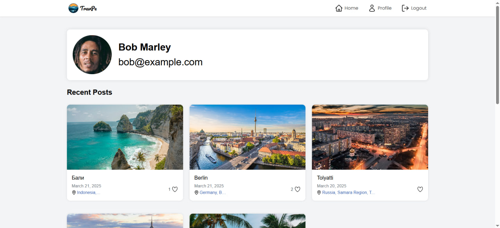
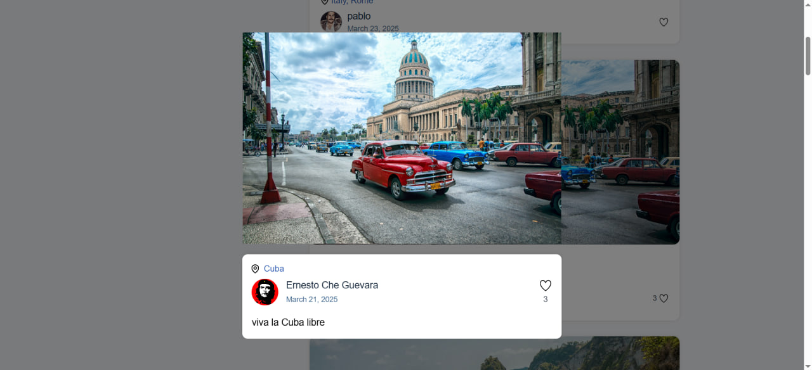
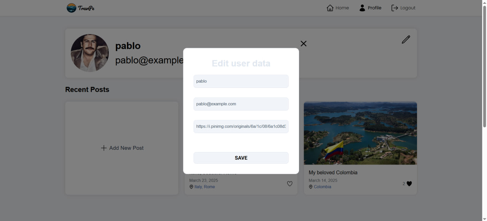
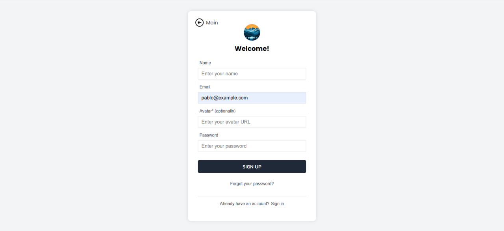

# Travpe

**Travpe** – это социальная сеть для путешественников, где пользователи могут делиться своими поездками, отмечать геолокации на карте и взаимодействовать друг с другом.

**URL**: [Travpe на Vercel](https://travpe.vercel.app/)

**Репозитории**:  
- [Frontend (Next.js)](https://github.com/pa-sh-tet/travpe_next_tsx)  
- [Backend (Express.js)](https://github.com/pa-sh-tet/travpe_backend)  

---

## 📌 Функциональность  

- **Пользователи**: регистрация, авторизация, редактирование профиля  
- **Посты**: создание, удаление, редактирование  
- **Лайки**: возможность лайкать/снимать лайк с постов  
- **Геолокация**: добавление локации к постам, отображение их на карте  
- **Просмотр профилей**: просмотр своей страницы и страниц других пользователей  
- **Попапы постов**: возможность открытия поста в отдельном модальном окне 

---

## 📍 Страницы  

| URL             | Описание |
|----------------|----------|
| `/`            | Главная страница (лента новостей) |
| `/profile`     | Страница текущего пользователя |
| `/profile/[id]` | Страница другого пользователя |
| `/login`       | Авторизация |
| `/register`    | Регистрация |

---

## 🚀 Используемые технологии  

### **Frontend**  
- **Next.js** – серверный рендеринг и маршрутизация  
- **Redux** – управление состоянием  
- **TypeScript** – статическая типизация  

### **Backend**  
- **Express.js** – серверный фреймворк  
- **Prisma** – ORM для работы с базой данных  
- **PostgreSQL** – база данных  
- **REST API** – взаимодействие между клиентом и сервером  

---

## 📚 Библиотеки и API  

### **Геолокация: Яндекс.Карты API**  
- **JavaScript API** – отображение геолокации на карте  
- **HTTP Геокодер** – преобразование адресов в координаты  

### **Дополнительные библиотеки**  
- **react-loading-skeleton** – скелетон-загрузки  
- **sass** – стилизация с препроцессорами  
- **bcrypt** – хеширование паролей

---

## 📷 Примеры работы

### Главная страница  
  

### Профиль пользователя  

### Попап поста с картой 

### Профиль другого пользователя

### Попап поста

### Попап добавления поста 

### Попап редактирования пользователя

### Регистрация 

